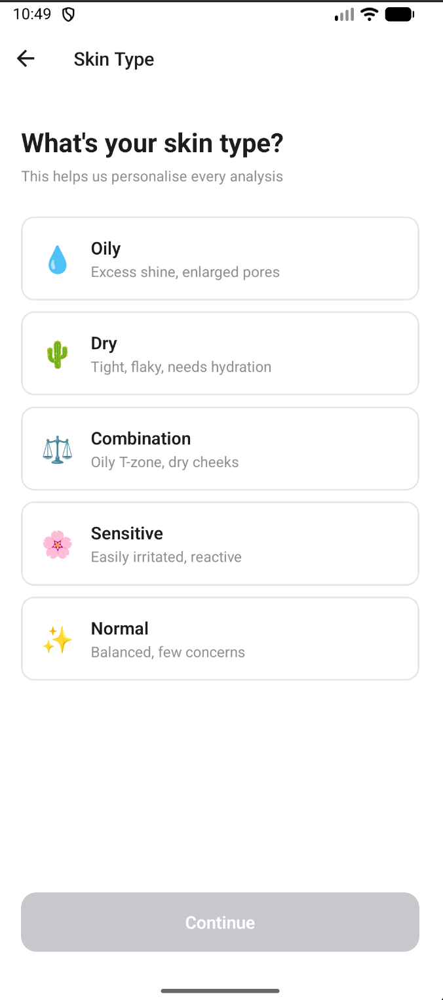
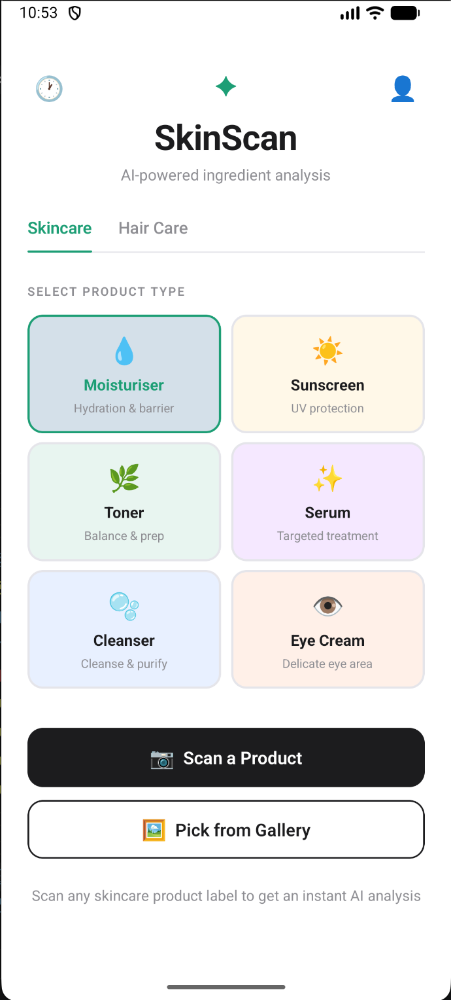
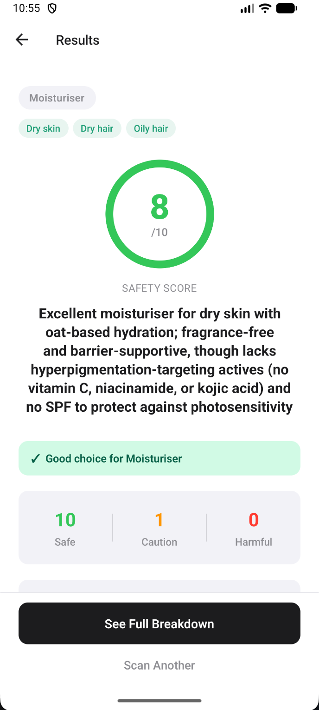
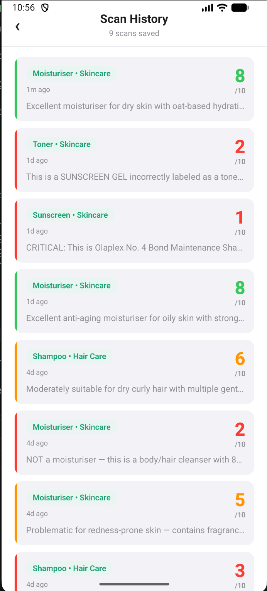

# 🧴 SkinScan

> AI-powered skincare & haircare ingredient analyzer for Android

SkinScan lets you scan any product's ingredient list and instantly get a
personalized safety score, ingredient breakdown, and recommendations —
powered by Claude AI (Anthropic).

---

## 📱 Screenshots

<!-- Add after first clean build -->
| Onboarding | Scan | Results | History |
|------------|------|---------|---------|
|  |  |  |  |

---

## ✨ Features

- 🤖 Ingredient analysis powered by Claude Haiku (Anthropic)
- 🎯 Personalized scoring based on skin type, hair type & concerns
- 🧪 Product-type aware scoring (moisturizer, shampoo, serum, sunscreen etc.)
- 📜 Scan history saved via Supabase
- 📡 Offline detection with graceful error handling
- 💬 User-friendly error messages — no technical jargon
- 🔒 Secure — API keys never exposed to users or logs

---

## 🛠 Tech Stack

| Layer | Technology |
|-------|------------|
| Mobile Framework | React Native CLI (no Expo) |
| Language | TypeScript |
| AI / Analysis | Claude Haiku — Anthropic API |
| Backend & Auth | Supabase (Postgres + Auth) |
| Navigation | React Navigation |
| Offline Detection | @react-native-community/netinfo |
| Notifications | react-native-toast-message |
| Platform | Android-first |

---

## 🏗 Project Structure

SkinScan/
├── src/
│   ├── components/        # Reusable UI components
│   │   └── ErrorBoundary.tsx
│   ├── screens/           # App screens
│   │   ├── OnboardingScreen.tsx
│   │   ├── QuickResultsScreen.tsx
│   │   └── HistoryScreen.tsx
│   ├── services/          # External integrations
│   │   └── claudeService.ts
│   ├── utils/             # Helpers & validators
│   │   ├── logger.ts
│   │   └── validateApiResponse.ts
│   ├── navigation/        # React Navigation setup
│   └── types/             # TypeScript types
├── android/               # Android native code
├── .env.example           # Environment variable template
└── README.md


---

## 🚀 Getting Started

### Prerequisites

- Node.js 18+
- JDK 17
- Android Studio + Android SDK 33+
- React Native CLI
- An [Anthropic API key](https://console.anthropic.com)
- A [Supabase](https://supabase.com) project

### 1. Clone the repo

```bash
git clone https://github.com/YOUR_USERNAME/SkinScan.git
cd SkinScan
```

### 2. Install dependencies

```bash
npm install
```

### 3. Set up environment variables

```bash
cp .env.example .env
```

Fill in your actual keys in `.env`:

```env
ANTHROPIC_API_KEY=sk-ant-your-key-here
SUPABASE_URL=https://your-project.supabase.co
SUPABASE_ANON_KEY=your-anon-key-here
```

### 4. Start Metro bundler

```bash
npx react-native start --reset-cache
```

### 5. Run on Android

```bash
npx react-native run-android
```

---

## 🤖 How the AI Works

1. User selects product type (moisturizer, shampoo, serum etc.)
2. User inputs the product's ingredient list
3. App sends ingredients + user profile to **Claude Haiku**
4. Claude returns structured JSON with per-ingredient analysis
5. App displays overall score, flagged ingredients & personalized recommendations

The prompt uses **per-product-type scoring rules** — ingredients
are evaluated differently depending on the product category.
For example, an occlusive ingredient scores well in a moisturizer
but poorly in an acne-fighting serum.

---

## ⚠️ Error Handling

| Scenario | Behaviour |
|----------|-----------|
| API credits exhausted | Friendly message, no crash |
| No internet connection | Persistent red banner, API calls blocked |
| Request timeout (15s) | Timeout message, retry option |
| Supabase save failure | Silent retry after 3s, toast on second failure |
| Invalid/empty input | Inline validation message below input |
| Malformed API response | Fallback message, no crash |
| Unhandled render error | ErrorBoundary screen with Restart button |

---

## 🔐 Security

- All API keys stored in `.env` (never committed)
- `.env` is in `.gitignore`
- API keys never logged or shown to users
- Supabase Row Level Security (RLS) enabled

---

## 🗺 Roadmap

- [ ] Camera OCR — scan ingredient labels directly
- [ ] iOS support
- [ ] Ingredient comparison between two products
- [ ] Recommended product suggestions (affiliate)
- [ ] Play Store release

---

## 🤝 Contributing

This is a personal project but feedback and suggestions are welcome.
Open an issue or reach out on [LinkedIn](https://www.linkedin.com/in/ayushi-sharma-3376a8189/).

---

## 👤 Author

**Your Name**
- GitHub: [@skyritzz](https://github.com/skyritzz)
- LinkedIn: [Ayushi Sharma](https://www.linkedin.com/in/ayushi-sharma-3376a8189/)

---

## 📄 License

SkinScan @ 2026

